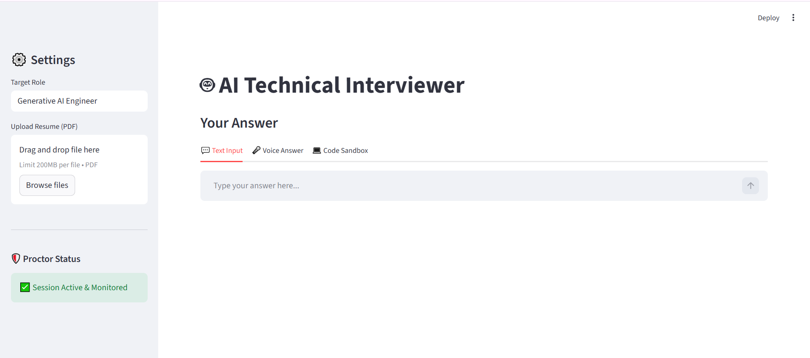
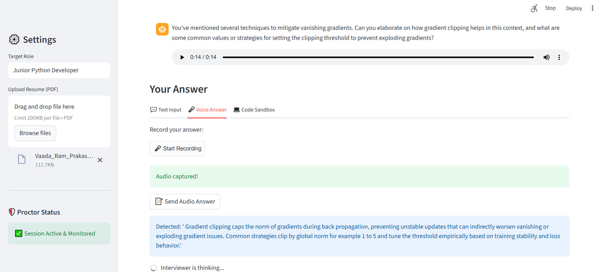
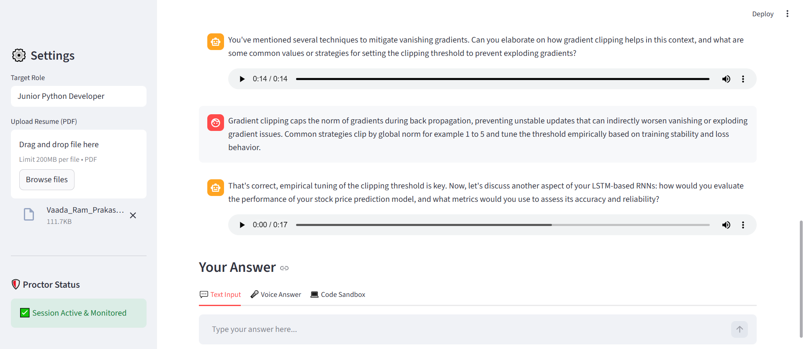
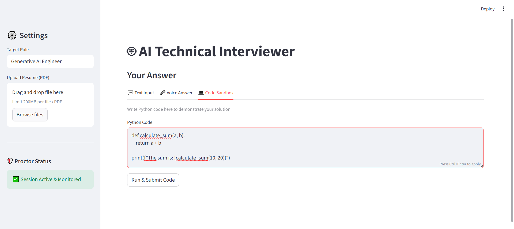
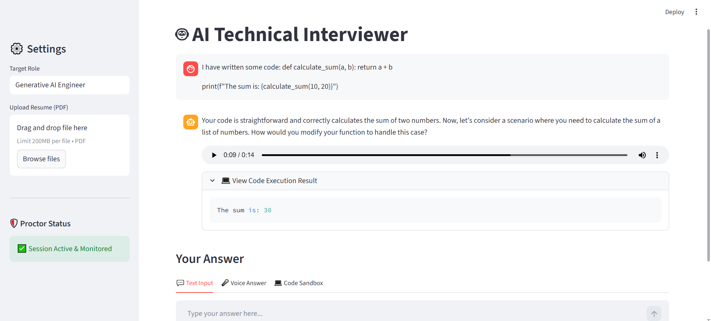
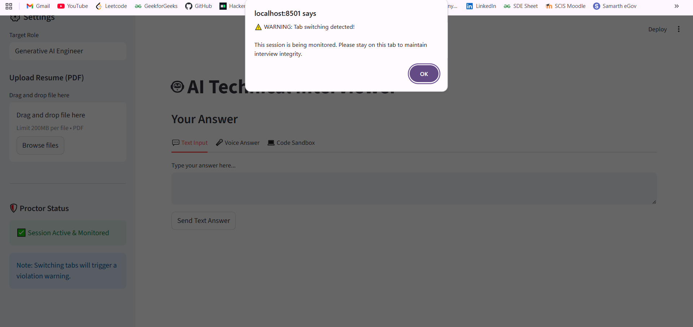

# 🤖 Smart Mock AI - The GenAI Technical Interviewer



## 🚀 Project Overview

**Smart Mock AI** is an intelligent, multimodal technical interview agent designed to simulate real-world coding interviews. It acts as a professional interviewer (e.g., "Generative AI Engineer", "Python Developer") and conducts a structured interview based on your **Resume** and **Job Role**.

Unlike standard chatbots, this agent provides a complete assessment environment:
1.  **Analyzes your Resume** (RAG Pipeline) to ask personalized, experience-based questions.
2.  **Conducts Coding Tests** in a live, secure Sandbox.
3.  **Speaks & Listens** (Full Voice Interaction) for a realistic verbal interview experience.
4.  **Detects Cheating** (Anti-Cheat Monitoring) to ensure interview integrity.

---

## ✨ Key Features

### 1. 📄 Resume-Based Personalization (RAG)
* **How it works:** Upload your PDF resume, and the AI parses it using **RAG (Retrieval-Augmented Generation)**. It generates questions specifically about *your* projects, tech stack, and experience.
* **Example:** If your resume mentions "Transformer Architecture," the AI will ask you to explain Self-Attention mechanisms.


### 2. 💬 Realistic Technical Chat
* **Contextual Memory:** The AI remembers your previous answers and asks deep follow-up questions, just like a human interviewer.
* **Role Adaptability:** You can set the target role (e.g., "Junior Python Dev" or "Senior Data Scientist"), and the AI adjusts the question difficulty and topics accordingly.

### 3. 🎤 Full Voice Interaction (Speech-to-Text & Text-to-Speech)
* **Speak Your Answers:** Powered by **Groq's Whisper (Turbo)** model for ultra-fast, accurate transcription of your voice.
* **Hear the Interviewer:** The AI responds with a natural, human-like voice using **Edge TTS**, making the interaction feel conversational.


*(The AI transcribing a voice answer about Gradient Clipping)*


*(The AI responding to the voice answer with a follow-up question)*

### 4. 💻 Live Code Sandbox
* **Execute Code Safely:** A built-in code editor allows you to write, run, and debug Python code directly in the browser.
* **AI Validation:** The interviewer runs your code against test cases and provides feedback on syntax, logic, and efficiency (Big O notation).
* **Secure Execution:** Powered by the **Piston API** (running in a secure container).


*(Writing code in the sandbox)*


*(The AI reviewing the code output and providing feedback)*

### 5. 🛡️ Anti-Cheat & Proctoring
* **Tab Switching Detection:** The system monitors focus events. If a candidate switches tabs (e.g., to Google an answer), the event is logged.
* **Session Monitoring:** A visible "Proctor Status" badge ensures the candidate is aware of the active monitoring.


---

## 🛠️ Tech Stack

| Component | Technology | Purpose |
| :--- | :--- | :--- |
| **Frontend** | Streamlit | Interactive UI (Chat, Voice Recorder, Sandbox) |
| **Backend** | FastAPI | High-performance API for handling logic |
| **LLM** | Groq (Llama 3) | Ultra-low latency intelligence |
| **RAG** | ChromaDB & LangChain | Resume context retrieval |
| **Voice** | Whisper (Groq) & EdgeTTS | Real-time Audio processing |
| **Sandbox** | Piston API | Safe remote code execution |
| **Orchestration**| LangGraph | Managing interview state and flow |

---

## ⚙️ Installation & Setup

### 1. Prerequisites
- Python 3.10 or higher
- An API Key from the Groq Console (Free tier available)

### 2. Set Up Environment Variables

Create a `.env` file in the root directory and add:

```ini
GROQ_API_KEY=gsk_your_actual_api_key_here_xxxxxxxxxxxxxx
```

---

## 3. Install Dependencies

Open your terminal in the project folder and run the following commands. It is recommended to use a virtual environment.

### Windows
```bash
python -m venv .venv
.\.venv\Scripts\activate
pip install -r requirements.txt
```

### Mac/Linux
```bash
python3 -m venv .venv
source .venv/bin/activate
pip install -r requirements.txt
```

---

## 🚀 How to Run

You must start the Backend and Frontend in two separate terminals.

### Terminal 1: Start the Backend (API)

```bash
# Make sure your virtual environment is active
python -m uvicorn app.main:app --reload --host 127.0.0.1 --port 8001
```

Wait until you see:
```
INFO: Application startup complete.
```

### Terminal 2: Start the Frontend (UI)

```bash
# Make sure your virtual environment is active
python -m streamlit run frontend/ui.py
```

The app will open automatically at:
http://localhost:8501

---

## 📂 Project Structure

```text
smart-mock-ai/
├── app/
│   ├── core/
│   │   ├── audio.py        # Text-to-Speech & Speech-to-Text logic
│   │   ├── graph.py        # LangGraph state machine (Interview Flow)
│   │   ├── rag.py          # Resume processing & Vector DB (Chroma)
│   │   └── sandbox.py      # Code execution engine
│   ├── main.py             # FastAPI routes (Endpoints)
│   └── prompts.py          # System prompts for the AI Persona
├── frontend/
│   └── ui.py               # Streamlit Dashboard & Client Logic
├── .env                    # API Keys (Keep this private!)
├── requirements.txt        # Python dependencies
└── README.md               # Project Documentation
```

---

## 🔮 Future Enhancements

- 📹 Video analysis using computer vision
- 📊 Detailed PDF feedback report
- 🌍 Multi-language interview support
- 🧩 Interactive system design whiteboard

---

## ⚠️ Troubleshooting

### Transcription failed / 500 Error
- Ensure `groq` is installed
- Check `.env` contains valid `GROQ_API_KEY`
- Verify model: `whisper-large-v3-turbo`

### Connection Refused / 404
- Ensure backend runs on port **8001**
- Verify in `frontend/ui.py`:
```python
API_URL = "http://127.0.0.1:8001"
```

### Sandbox Error
- Requires active internet connection for Piston API
